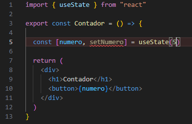

# Guía básica para entender React

# Contenido
- [¿Qué es React?](#qué-es-react)
- [Diferencia entre un framework y una librería](#diferencia-entre-un-framework-y-una-librería)
- [¿Cuándo usar cada uno?](#cuándo-usar-cada-uno)
- [Crear un proyecto con React](#crear-un-proyecto-con-react)
- [Reconocimiento de carpetas y archivos](#reconocimiento-de-carpetas-y-archivos)
- [Diferencias entre export default y export const](#diferencias-entre-export-default-y-export-const)
- [Los Hooks](#los-hooks)

## ¿Qué es React?
React es una librería o biblioteca que se utiliza para construir interfaces de usuario en **una sola página index.html**. React trabaja por medios de componentes, que son bloques de código reutilizables. Estos interactúan entre sí para crear interfaces de manera modular.

## Diferencia entre un framework y una librería
La principal diferencia entre un framework y una librería es el control de flujo de trabajo. Con una librería, tú puedes decidir cuándo renderizar, que funciones usar, etc. En cambio, un framework te da una estructura fija y te dice cómo organizar los archivos, cómo hacer rutas, cómo renderizar.

**React → Librería**

**Next.js → Framework**

## ¿Cuándo usar cada uno?
Una librería como React se usa para proyectos pequeños o medianos y cuándo no tienes que crear un backend. Un framework se usa para proyectos grandes a nivel empresarial y cuándo tienes que crear tu propio backend.

## Crear un proyecto con react
Para crear un proyecto con React se recomienda utilizar **[Vite](https://vite.dev/)**. Anteriormente se ocupaba Create React App pero eso ya quedo en el pasado **(lo dice la misma documentación oficial de [React](https://es.react.dev/learn/installation).**


Según la documentación oficial para crear un proyecto con Vite en la terminal escribimos:
```
npm create vite@latest
```
Nos pedirá el nombre del proyecto, seleccionar un framework (React) y el lenguaje a utilizar (JS en este ejemplo)


Después corremos los comandos que nos muestra
```
cd nombre-del-proyecto
npm install
npm run dev
```

Y para ejecutarlo escribimos
```
npm run dev
```
> Nota ⚠ Para detener el proyecto presiona **`ctrl + c`**

Nos arroja un localhost y al abrirlo nos muestra lo siguiente:


## Reconocimiento de carpetas y archivos

```
carpeta-raiz/
├── node_modules/
├── public/
├── src/
│ ├── assets/
│ ├── App.css
│ ├── App.jsx
│ ├── index.css
│ ├── main.jsx
├── .gitignore
├── eslint.config.js
├── index.html
├── package-lock.json
├── package.json
├── README.md
├── vite.config.js
```

- `node_modules` Esta carpeta no debemos tocarla. Aquí se encuentran las carpetas, archivos, paquetes necesarios para que el proyecto con React funcione en nuestro localhost
- `public` En esta carpeta van a ir los archivos públicos principales, por ejemplo el logo.
- `src` src significa source y dentro de esta carpeta es donde vamos a estar trabajando.
- `assets` Dentro de src tenemos ya creada la carpeta assets, que es una carpeta para archivos (imagenes, musica, videos).
- `main.jsx` Este es el archivo principal (por eso se llama main). 
Si abrimos este archivo nos damos cuenta que trae una etiqueta propia de React `<StrictMode>`. Lo que hace es una capa de testeo ya que se encarga de renderizar (mostrar) tu aplicación dos veces. No debe de quitarse, sirve sobre todo para modo de desarrollo, cuándo pasamos a producción este desaparece automáticamente.
- `App.jsx` Este archivo representa ya tu proyecto global. Todos los archivos van a estar embedidos en este App.jsx
- `App.css` Estos estilos y los demás que se creen ya son CSS propios de cada página.
- `index.css` Representa el archivo principal de estilos, estos son CSS que van a estar de forma global para todo el proyecto. Estos si puedes modificarlos como tu quieras.
- `.gitignore` Este archivo nos va a servir para ignorar archivos y carpeta cuando subamos nuestro proyecto a GitHub.
- `eslint.config.js` Es como el primer filtro para errores. Cualquier error o problema que exista con React se va a poder visualizar.
- `index.html` Recuerda que React trabaja sobre una única página index.html. Entonces aqui es donde va a indexarse todos los componentes.
- `package-lock.json` Este no lo vamos a tocar. Este es un archivo generado automáticamente por NPM que documenta la versión exacta de cada dependencia instalada en el proyecto. Se utiliza para bloquear las versiones exactas de las dependencias instaladas, asegurando la reproducibilidad y las instalaciones consistentes en diferentes entornos.
- `package.json` Este archivo se utiliza principalmente para administrar y documentar metadatos sobre el proyecto, como: nombre, versión, autor, dependencias, scripts y otros detalles de configuración.
- `README.md` Es un archivo con extensión markdown y nos puede servir para realizar la documentación del proyecto, por ejemplo: de que trata, que tecnologías se utilizan, los contribuidores, etc. Sirve más que nada al momento de subirlo a GitHub.
- `vite.config.js` Son los plugins de vite, que nos sirve para que React nos funcione.

## Diferencias entre export default y export const
En React (y JavaScript en general), existen dos formas principales de exportar funciones, componentes o variables desde un archivo: export default y export const.
Aunque ambas sirven para hacer que algo sea accesible desde otros archivos, funcionan de manera distinta y tienen usos diferentes.

#### Export default
Esta forma exporta una sola entidad como la exportación principal del archivo.
Ejemplo>
```
function App() {
  return <h1>Hola Mundo</h1>
}

export default App;
```
Se importa sin llaves y puedes cambiar el nombre al importar:
```
import App from './App';
-- o --
import MiComponente from './App';
```
**Ventajas**
- Solo puede haber una exportación por defecto por archivo.
- Es más flexible al importar (puedes renombrar el componente sin usar as).

#### Export const
Esta forma exporta una o varias exportaciones nombradas.
```
export const App = () => {
  return <h1>Hola Mundo</h1>
}
```
Se importa con llaves y debe usar el mismo nombre (o usar as para renombrar):
```
import { App } from './App';
-- o --
import { App as MiComponente } from './App';
```
**Ventajas**
Puedes exportar múltiples cosas desde un archivo. Por ejemplo:
```
export const App = () => <h1>Hola</h1>
export const Header = () => <h2>Header</h2>
```
Y luego para utilizarlo
```
import { App, Header } from './App';
```

**Entonces cuál debo usar**
Si vas a exportar solo un componente principal por archivo, utiliza `export default` y para múltiples componentes, utiliza `export const`.

## Los Hooks
Los hooks (o ganchos) son funciones especiales que dan acceso a las funcionalidades internas de React. Es como si los hooks fueran "superpoderes" que le podemos dar a los componentes.

Los hooks más fundamentales de React son:
- useState (el "superpoder" de recordar información): useState nos permite añadir un **estado** a los componentes de función. El estado es la memoria del componente, esto significa que tu componente puede guardar información y reaccione a los cambios. Algo importante que debemos saber es que esta memoria es temporal, por lo que si recargamos se pierde la información que tenia guardada el estado.
Partes del useState:
➡ **estado:** El estado va a ser el valor actual que se va a renderizar (mostrar).
➡ **función:** La función va a actualizar el estado.
➡ **useState (hook):** El nombre del hook que vamos a utilizar.
➡ **valor:** El valor con el que empieza el estado. Este valor puede ser cero, booleano, texto, objetos, arrays, data, etc.

Para poder utilizar useState lo importamos de la siguiente manera:
`import { useState } from "react";`

  Ejemplo:
  