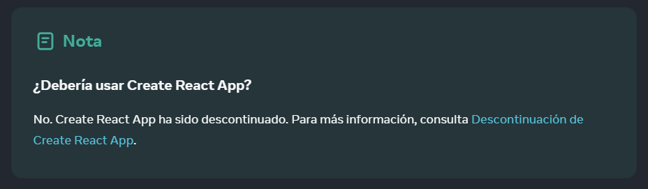
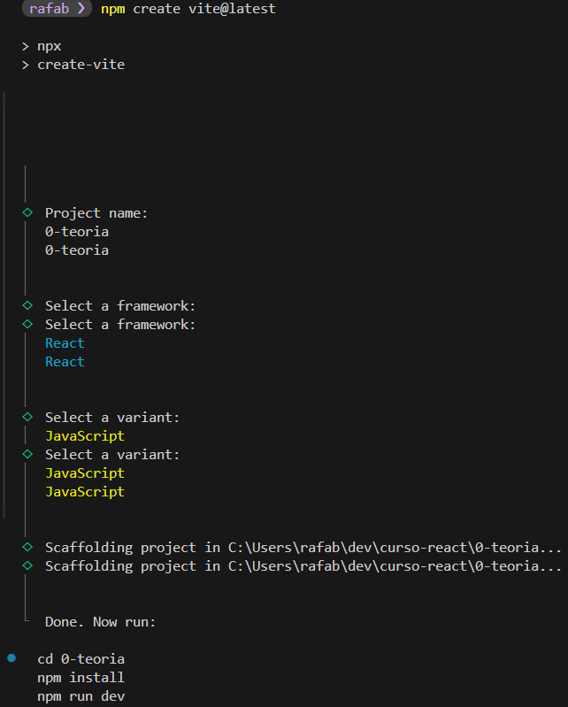
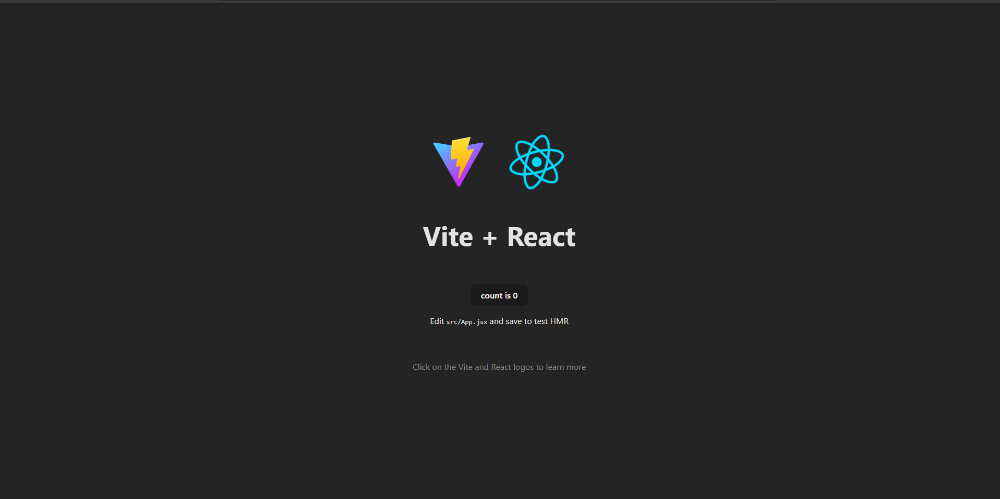
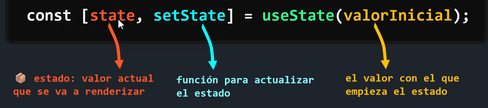

# Guía básica para entender React

# Contenido
- [¿Qué es React?](#qué-es-react)
- [Diferencia entre un framework y una librería](#diferencia-entre-un-framework-y-una-librería)
- [¿Cuándo usar cada uno?](#cuándo-usar-cada-uno)
- [Crear un proyecto con React](#crear-un-proyecto-con-react)
- [Reconocimiento de carpetas y archivos](#reconocimiento-de-carpetas-y-archivos)
- [Diferencias entre export default y export const](#diferencias-entre-export-default-y-export-const)
- [Hooks: useState y useEffect](#hooks-usestate-y-useeffect)

## ¿Qué es React?
React es una librería o biblioteca que se utiliza para construir interfaces de usuario en **una sola página index.html**. React trabaja por medios de componentes, que son bloques de código reutilizables. Estos interactúan entre sí para crear interfaces de manera modular.

## Diferencia entre un framework y una librería
La principal diferencia entre un framework y una librería es el control de flujo de trabajo. Con una librería, tú puedes decidir cuándo renderizar, que funciones usar, etc. En cambio, un framework te da una estructura fija y te dice cómo organizar los archivos, cómo hacer rutas, cómo renderizar.

**React → Librería**

**Next.js → Framework**

## ¿Cuándo usar cada uno?
Una librería como React se usa para proyectos pequeños o medianos y cuándo no tienes que crear un backend. Un framework se usa para proyectos grandes a nivel empresarial y cuándo tienes que crear tu propio backend.

## Crear un proyecto con react
Para crear un proyecto con React se recomienda utilizar **[Vite](https://vite.dev/)**. Anteriormente se ocupaba Create React App pero eso ya quedo en el pasado **(lo dice la misma documentación oficial de [React](https://es.react.dev/learn/installation).**


Según la documentación oficial para crear un proyecto con Vite en la terminal escribimos:
```
npm create vite@latest
```
Nos pedirá el nombre del proyecto, seleccionar un framework (React) y el lenguaje a utilizar (JS en este ejemplo)


Después corremos los comandos que nos muestra
```
cd nombre-del-proyecto
npm install
npm run dev
```

Y para ejecutarlo escribimos
```
npm run dev
```
> Nota ⚠ Para detener el proyecto presiona **`ctrl + c`**

Nos arroja un localhost y al abrirlo nos muestra lo siguiente:


## Reconocimiento de carpetas y archivos

```
carpeta-raiz/
├── node_modules/
├── public/
├── src/
│ ├── assets/
│ ├── App.css
│ ├── App.jsx
│ ├── index.css
│ ├── main.jsx
├── .gitignore
├── eslint.config.js
├── index.html
├── package-lock.json
├── package.json
├── README.md
├── vite.config.js
```

- `node_modules` Esta carpeta no debemos tocarla. Aquí se encuentran las carpetas, archivos, paquetes necesarios para que el proyecto con React funcione en nuestro localhost
- `public` En esta carpeta van a ir los archivos públicos principales, por ejemplo el logo.
- `src` src significa source y dentro de esta carpeta es donde vamos a estar trabajando.
- `assets` Dentro de src tenemos ya creada la carpeta assets, que es una carpeta para archivos (imagenes, musica, videos).
- `main.jsx` Este es el archivo principal (por eso se llama main). 
Si abrimos este archivo nos damos cuenta que trae una etiqueta propia de React `<StrictMode>`. Lo que hace es una capa de testeo ya que se encarga de renderizar (mostrar) tu aplicación dos veces. No debe de quitarse, sirve sobre todo para modo de desarrollo, cuándo pasamos a producción este desaparece automáticamente.
- `App.jsx` Este archivo representa ya tu proyecto global. Todos los archivos van a estar embedidos en este App.jsx
- `App.css` Estos estilos y los demás que se creen ya son CSS propios de cada página.
- `index.css` Representa el archivo principal de estilos, estos son CSS que van a estar de forma global para todo el proyecto. Estos si puedes modificarlos como tu quieras.
- `.gitignore` Este archivo nos va a servir para ignorar archivos y carpeta cuando subamos nuestro proyecto a GitHub.
- `eslint.config.js` Es como el primer filtro para errores. Cualquier error o problema que exista con React se va a poder visualizar.
- `index.html` Recuerda que React trabaja sobre una única página index.html. Entonces aqui es donde va a indexarse todos los componentes.
- `package-lock.json` Este no lo vamos a tocar. Este es un archivo generado automáticamente por NPM que documenta la versión exacta de cada dependencia instalada en el proyecto. Se utiliza para bloquear las versiones exactas de las dependencias instaladas, asegurando la reproducibilidad y las instalaciones consistentes en diferentes entornos.
- `package.json` Este archivo se utiliza principalmente para administrar y documentar metadatos sobre el proyecto, como: nombre, versión, autor, dependencias, scripts y otros detalles de configuración.
- `README.md` Es un archivo con extensión markdown y nos puede servir para realizar la documentación del proyecto, por ejemplo: de que trata, que tecnologías se utilizan, los contribuidores, etc. Sirve más que nada al momento de subirlo a GitHub.
- `vite.config.js` Son los plugins de vite, que nos sirve para que React nos funcione.

## Diferencias entre export default y export const
En React (y JavaScript en general), existen dos formas principales de exportar funciones, componentes o variables desde un archivo: export default y export const.
Aunque ambas sirven para hacer que algo sea accesible desde otros archivos, funcionan de manera distinta y tienen usos diferentes.

#### Export default
Esta forma exporta una sola entidad como la exportación principal del archivo.
Ejemplo>
```jsx
function App() {
  return <h1>Hola Mundo</h1>
}

export default App;
```
Se importa sin llaves y puedes cambiar el nombre al importar:
```jsx
import App from './App';
-- o --
import MiComponente from './App';
```
**Ventajas**
- Solo puede haber una exportación por defecto por archivo.
- Es más flexible al importar (puedes renombrar el componente sin usar as).

#### Export const
Esta forma exporta una o varias exportaciones nombradas.
```jsx
export const App = () => {
  return <h1>Hola Mundo</h1>
}
```
Se importa con llaves y debe usar el mismo nombre (o usar as para renombrar):
```jsx
import { App } from './App';
-- o --
import { App as MiComponente } from './App';
```
**Ventajas**
Puedes exportar múltiples cosas desde un archivo. Por ejemplo:
```jsx
export const App = () => <h1>Hola</h1>
export const Header = () => <h2>Header</h2>
```
Y luego para utilizarlo
```jsx
import { App, Header } from './App';
```

**Entonces cuál debo usar**
Si vas a exportar solo un componente principal por archivo, utiliza `export default` y para múltiples componentes, utiliza `export const`.

## Hooks: useState y useEffect 
Los hooks (o ganchos) son funciones especiales que dan acceso a las funcionalidades internas de React. Es como si los hooks fueran "superpoderes" que le podemos dar a los componentes.

Los hooks más fundamentales de React son:

#### UseState (el "superpoder" de recordar información):
useState nos permite añadir un **estado** a los componentes de función. El estado es la memoria del componente, esto significa que tu componente puede guardar información y reaccione a los cambios. Algo importante que debemos saber es que esta memoria es temporal, por lo que si recargamos se pierde la información que tenia guardada el estado.

Partes del useState:
   - **estado:** El estado va a ser el valor actual que se va a renderizar (mostrar).
   - **función:** La función va a actualizar el estado.
   - **useState (hook):** El nombre del hook que vamos a utilizar.
   - **valor:** El valor con el que empieza el estado. Este valor puede ser cero, booleano, texto, objetos, arrays, data, etc.
     


Para poder utilizar useState lo importamos de la siguiente manera:
`import { useState } from "react";`

Ejemplo:
```jsx
import { useState } from 'react'

export const Contador = () => {

  const [numero, setNumero] = useState()

  return (
    <div>
    <h1>Contador</h1>
    <button>{numero}</button>
    </div>
  )
}
```

#### UseEffect (el "superpoder" de realizar acciones después de renderizar): 
useEffect nos permite ejecutar código cuando el componente se monta, se actualiza o se desmonta. Esto es crucial para manejar lo que llamamos "efectos secundarios", que son acciones que interactúan con el mundo exterior o no forman parte de la lógica de renderizado principal de tu componente. Piensa en useEffect como el lugar donde tu componente puede reaccionar a eventos externos o a cambios internos después de haberse mostrado en pantalla.

¿En qué se suele utilizar?
useEffect es el hook ideal para manejar operaciones que necesitan ocurrir en momentos específicos de la vida de un componente. Se usa comúnmente para:
- Llamar a una API: Para obtener datos de un servidor web una vez que el componente se ha cargado.
- Escuchar eventos: Para suscribirse a eventos del navegador (como redimensionar la ventana o clics globales).
- Temporizadores: Para configurar setTimeout o setInterval (como en tu ejemplo del contador).
- Sincronizar con localStorage: Para guardar o cargar datos que persisten en el navegador.
- Limpiar suscripciones o temporizadores: Para liberar recursos cuando el componente se desmonta y evitar fugas de memoria.

Partes del useEffect:
useEffect tiene dos partes principales:
- Función de efecto: Es el código que deseas ejecutar. Esta función se dispara después de cada renderizado del componente, a menos que especifiques lo contrario.
- Array de dependencias (opcional): Este array es crucial para controlar cuándo se ejecuta tu efecto.
  - Si el array está vacío (`[]`): El efecto se ejecuta solo una vez cuando el componente se monta por primera vez (ideal para llamadas a API iniciales o configuración de listeners).
  - Si el array no está presente: El efecto se ejecuta después de cada renderizado del componente (lo que puede llevar a bucles infinitos si no se usa con cuidado).
  - Si el array contiene variables (`[variable1, variable2]`): El efecto se ejecuta cuando el componente se monta y cada vez que alguna de esas variables cambia su valor.
- Función de limpieza (`return () => {}`): Opcionalmente, la función que pasas a useEffect puede retornar otra función. React ejecutará esta función de "limpieza" justo antes de que el componente se desmonte, o antes de que el efecto se vuelva a ejecutar debido a un cambio en sus dependencias. Esto es vital para detener temporizadores, cancelar suscripciones, o limpiar recursos que ya no son necesarios.

Ejemplo:
```js
import { useEffect, useState } from 'react'

export const UseEffectPage = () => {
  const [segundos, setSegundos] = useState(0)


  useEffect(() => {
    // 1. Aquí se configura el "efecto secundario": un temporizador que incrementa 'segundos'
    const intervalo = setInterval(() => {
      setSegundos((s) => s + 1); // La función para actualizar el estado 'segundos'
    }, 1000);

    // 2. Esta es la función de limpieza: Se ejecuta cuando el componente se desmonta
    // o antes de que el efecto se vuelva a ejecutar si las dependencias cambiaran.
    return () => clearInterval(intervalo); // Importante: detiene el temporizador para evitar fugas de memoria
  }, []); // Array de dependencias vacío []: el efecto se ejecuta solo una vex al montar. Este siempre hay que ponerlo para evitas que se ejecute en cada renderizado.

  // Función para reiniciar el contador (usa useState)
  const reiniciarContador = () => {
    setSegundos(0);
  }

  return (
    <div>
      <h2>UseEffectPage</h2>
      <div>
        <span>{segundos}</span>
      </div>
      <div>
        <button onclick={reiniciarContador}>Reiniciar a cero</button>
      </div>
    </div>
  );
};
```

## Map
El método `map()` permite recorrer un arreglo y devolver algo nuevo por cada elemento.

### ¿Cómo funciona?
Imagina que tienes una lista de datos (como nombres de frutas). Con `map()`, puedes recorrer esa lista y, por cada dato, crear un componente o un elemento HTML que React pueda mostrar en tu aplicación.

Ejemplo:
```jsx
function App() {

  const frutas = ['manzana', 'pera', 'platano']; // Nuestro array de datos

  return (
    <div>
      {
        // Usamos llaves {} para insertar JavaScript
        frutas.map((item, index) => { // 'map' itera sobre cada fruta

          return (
            // Por cada fruta, devolvemos un <div>
            <div key={index}> {/* ¡La 'key' es crucial en React! */}
              {item} - {index}
            </div>
          );
        })
      }
    </div>
  );
}

export default App;
```
- item: En cada "vuelta" del bucle, item representa el elemento actual del array frutas.
  - Primera vuelta: 'manzana'
  - Segunda vuelta: 'pera'
  - Tercera vuelta: 'platano'

- index: En cada vuelta del bucle index nos da la posición numérica (el índice) de ese item dentro del array.
  - Para 'manzana', index es 0.
  - Para 'pera', index es 1.
  - Para 'platano', index es 2.

- `<div key={index}>:` El atributo key es indispensable cuando renderizamos listas en React. Le da a cada elemento de la lista un identificador único, lo que ayuda a React a optimizar el rendimiento y a saber qué elementos han cambiado, se han añadido o eliminado. Aunque index funciona, la mejor práctica es usar un ID único de tus datos si lo tienes.
- `{item} - {index}:` Dentro del div, mostramos el valor de la fruta (item) y su posición (index).

## Router
React al ser una librería centrada en interfaces no cuenta con una herramienta nativa para navegar entre diferentes páginas. Para añadir esta funcionalida, necesitamos una herramienta externa y la solución más popular es **React Router Dom**.

#### Instalación de React Router Dom
Para instalar react router dom utilizamos el siguiente comando: `npm i react-router-dom`

#### Configuración Básica del Router
Es una buena práctica organizar las rutas en un archivo separado para mantener el código limpio.

1. Crea una nueva carpeta llamada `routers` dentro de `src`
2. Dentro de `src/routers`, crea un archivo llamado `router.jsx`.

```jsx
// Importamos los componentes de React Router Dom
import { BrowserRouter, Route, Routes } from "react-router-dom";

// Importamos los componentes de nuestras "paginas"
import { Home } from "../pages/Home";
import { Login } from "../pages/Login";
import { Page404 } from "../pages/Page404";

// Definimos un componente que contendra todas las rutas
export const MyRoutes = () => (
  <BrowserRouter>
    <Routes>
      <Route path="/" element={<Home />}/>
      <Route path="/login" element={<Login />}/>
      <Route path="*" element={<Page404 />}/>
    </Routes>
  </BrowserRouter>
)
```
- `<BrowserRouter>`: Este es el componente principal que "envuelve" toda la aplicacion.
- `<Routes>`: Funciona como un contenedor para todas tus rutas individuales (`<Route>`). La característica clave de `<Routes>` es que renderiza solo la primera `<Route>` que coincide con la URL actual, lo que evita que se rendericen múltiples rutas por accidente.
- `<Route>`: Este componente define una ruta específica.
  - `path`: Es la propiedad que especifica el camino (la URL) que debe coincidir para que esta ruta sea activa.
  - `element`: Es la propiedad que recibe el componente de React que se renderizará cuando el path coincida, por ejemplo: `<Home />`.
  
#### Integrar rutas en la aplicacion
Para que las rutas funciones, necesitas importar y renderizar tu componente `MyRoutes` en el archivo principal `App.jsx`.
  
Ejemplo en `App.jsx`:
```jsx
import { MyRoutes } from "./routers/router";

function App() {
  return (
    <MyRoutes />
    );
}
export default App;
```

#### Rutas anidadas
